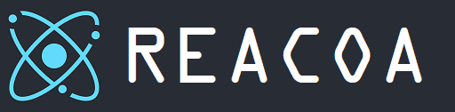

# Reacoa

Reacoa is a turnkey solution that integrates webpack, react, http-server and electron.
> Enjoying it :)

## Quick Start

```
$ npm run init
$ npm start
```

## Scripts

| Path    | Script      | Description                                                  |
| ------- | ----------- | ------------------------------------------------------------ |
| /       | init        | Install dependence and build front-end files.                                         |
| /       | start       | Run electron.                                                |
| /       | lint        | Eslint check.                                                |
| /       | lint-fix    | Eslint check and autofix.                                   |
| /       | build-front | Build front-end code. Saved in `/front/build` & `/server/front.` |
| /       | build-win   | Build Electron app for windows platform.                     |
| /       | build-linux | Build Electron app for linux platform.                       |
| /       | build-mac   | Build Electron app for mac platform.                         |
| /front  | start       | Develop front-end code.                                      |
| /front  | build       | Build front-end code. Saved in `/front/build` & `/server/front.` |
| /front  | test        | Run tests.                                                   |
| /server | start       | Start http-server by `/server/index.js`                                       |

## Directory Structure

```
|-- projects
    |-- README.md
    |-- index.js
    |-- package.json
    |-- reacoa.lock.md # reacoa lock file
    |-- front # front-end project
    |   |-- package.json
    |   |-- build # built files
    |   |-- config # dev configs
    |       |-- preRenderList.js # list paths need to pre-render
    |   |-- public # html frame
    |   |-- scripts # npm scripts
    |   |-- src # source dir
    |       |-- App.jsx # react root node
    |       |-- App.test.js
    |       |-- index.js # entrance
    |       |-- index.less # global/basic styles
    |       |-- serviceWorker.js
    |       |-- component
    |       |   |-- lib # predefined components by reacoa
    |       |       |-- Example # reacoa default home page
    |       |       |-- Template # used for replication usually
    |       |       |-- ThrowError # throw a error for error catching test
    |       |       |-- WithErrorBoundary # decorator for error catching
    |       |-- store # mobx store
    |       |   |-- model
    |       |       |-- example.js
    |       |   |-- index.js # root store
    |       |   |-- router.js # router store
    |       |-- page
    |       |   |-- 404.jsx
    |       |   |-- index.jsx
    |       |-- util
    |           |-- example.js
    |-- server # back-end project(optional)
        |-- app.js # server
        |-- electron.js # electron app's entrance
        |-- index.js # start server
        |-- package.json
        |-- router.js # router defines
        |-- front # front-end files(generated by front-end project automatically)
        |-- assets # static resources for electron
        |   |-- favicon.ico
        |   |-- favicon.png # necessary for electron-build-linux
        |-- config
            |-- electron.js # electron build configs

```

## Basic Configs

### Version Control

Set your own version control information in `/package.json`.

### Icon  & Title

Set icon and title in `/front/public`.

If you are using Electron, change app name and version in `/server/package.json`.

```
"name": "reacoa",
"version": "0.1.2",
```

## Related

- [React](https://reactjs.org/docs/getting-started.html) A JavaScript library for building user interfaces.
- [create-react-app](https://facebook.github.io/create-react-app/docs/getting-started) An officially supported way to create single-page React applications.
- [webpack](https://webpack.js.org/concepts/) Webpack is a module bundler.
- [axios](https://www.npmjs.com/package/axios) Promise based HTTP client for the browser and node.js
- [mobx](https://cn.mobx.js.org/) Simple, scalable state management.
- [sass](http://sass-lang.com/guide) 	Sass is the most mature, stable, and powerful professional grade CSS extension language in the world.
- [styled-components](https://www.styled-components.com/docs) Use the best bits of ES6 and CSS to style your apps without stress.
- [koa](https://koa.bootcss.com/) Next generation web framework for node.js
- [koa-router](https://www.npmjs.com/package/koa-router) Router middleware for koa.
- [lowdb](https://www.npmjs.com/package/lowdb) Small JSON database for Node, Electron and the browser. Powered by Lodash. 
- [Electron](https://electronjs.org/docs) Build cross platform desktop apps with JavaScript, HTML, and CSS.
- [electron-packager](https://www.npmjs.com/package/electron-packager) Package your Electron app into OS-specific bundles (.app, .exe, etc.) via JavaScript or the command line.
- [fs-extra](https://www.npmjs.com/package/fs-extra) fs-extra is a drop in replacement for native fs.
- [inquirer](https://www.npmjs.com/package/inquirer) A collection of common interactive command line user interfaces.


## Release

### [latest](https://github.com/yuri2peter/reacoa.git)

- [front] prerender-spa-plugin
- [front] remove `CssBaseLine`
- [global] use `portfinder` instead of `get-port`
- [front] use taobao css reset in CssBaseLine
- [front] mobx store
- [front] use browser router
- [electron] set 'home'='Your remote APP URL' in file `/server/config/electron.js`
- [electron] use absolute path
- [electron] http server is necessary
- [server] http server is accessible for intranets only (IP whitelist)
- [front] libs
  - CssBaseLine
  - WarpperCenter
- [front] dependence
  - react-loading
- [global] eslint tools
- [global] add related Doc links
- [global] fixed a typo in script build-mac
- [global] fixed a typo in script init

### [v0.1.2](https://github.com/yuri2peter/reacoa/tree/v0.1.2)

- better `README.md`
- use 'npm ci' to install dependence
